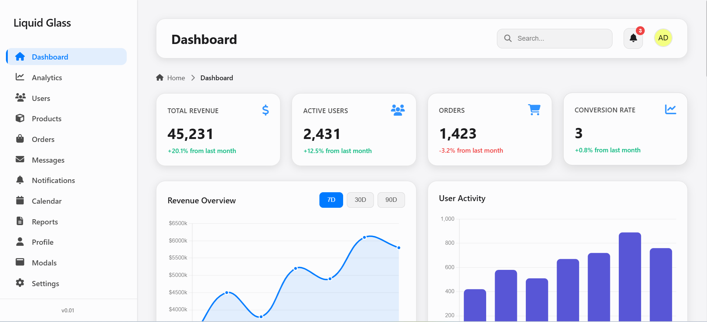

# Liquid Glass Admin Dashboard Template

A beautiful, modern admin dashboard template inspired by Apple's liquid glass (glassmorphism) design aesthetic. Built with pure HTML, CSS, and JavaScript - no frameworks required.




## ✨ Features

- 🎨 **Liquid Glass Design** - Beautiful glassmorphism UI inspired by Apple's design language
- 📱 **Fully Responsive** - Optimized for all screen sizes with mobile-first approach
- 📊 **Interactive Charts** - Multiple chart types (line, bar, doughnut, pie, radar) using Chart.js
- 💳 **Dashboard Cards** - Stat cards, info cards, transaction lists, and more
- 📋 **Comprehensive Tables** - Various table styles (basic, bordered, striped, hoverable, with images)
- 🎯 **Modern UI Components** - Clean, modern components ready for customization
- ⚡ **Pure JavaScript** - No framework dependencies, just vanilla JS
- 🌈 **Smooth Animations** - Beautiful transitions, hover effects, and micro-interactions
- 🎨 **Customizable** - Easy to customize colors, styles, and components
- ♿ **Accessible** - Built with accessibility in mind (keyboard navigation, focus states)
- 🚀 **Performance Optimized** - Optimized animations and smooth scrolling
- 📱 **Mobile Optimized** - Touch-friendly interface with proper mobile navigation

## 🚀 Getting Started

### Prerequisites

- A modern web browser (Chrome, Firefox, Safari, Edge)

### Installation

1. Clone the repository:
```bash
git clone https://github.com/Dexterwura/liquidglassadmin.github.io.git
```

2. Navigate to the project directory:
```bash
cd liquidglassadmin.github.io
```

3. Open `index.html` in your web browser.

## Webhook Packaging (Flipit)

Use `flipit-webhook.php` to trigger buyer package generation after a successful purchase.

- **Endpoint**: `POST /flipit-webhook.php`
- **Auth (recommended)**: set env var `FLIPIT_WEBHOOK_SECRET` and send header `X-Flipit-Signature: sha256=<hmac_of_raw_body>`
- **Auth (fallback)**: set env var `FLIPIT_WEBHOOK_TOKEN` and call endpoint with `?token=<same_value>`
- **Optional payload fields**: `order_id`, `buyer_email`, `version`

The endpoint generates a fresh buyer ZIP in `release/dist/` using raw `HTML/CSS/JS` assets and returns JSON metadata.

## 📁 Project Structure

```
liquid-glass-admin-template/
│
├── index.html              # Landing page
├── dashboard.html          # Main dashboard page
├── analytics.html          # Analytics page
├── users.html              # Users management page
├── products.html           # Products page
├── orders.html             # Orders page
├── pos.html                # Point of Sale page
├── messages.html           # Messages page
├── notifications.html      # Notifications page
├── calendar.html           # Calendar page
├── reports.html            # Reports page
├── tables.html             # Tables showcase page
├── forms.html              # Forms showcase page
├── buttons.html            # Buttons showcase page
├── profile.html            # Profile page
├── settings.html           # Settings page
├── modals.html             # Modals demo page
├── login.html              # Login page
├── signup.html             # Sign up page
├── README.md               # Project documentation
├── LICENSE                 # Commercial License
│
└── assets/
    ├── css/
    │   └── style.css       # Main stylesheet
    ├── js/
    │   ├── main.js         # Main JavaScript file
    │   ├── analytics.js    # Analytics page scripts
    │   └── modals.js       # Modals functionality
    └── images/
        └── dash.png        # Dashboard preview image
```

## 🎨 Components

### Dashboard Elements

- **Statistics Cards** - Display key metrics with icons and trend indicators
- **Revenue Chart** - Interactive line chart showing revenue over time
- **Activity Chart** - Bar chart displaying user activity
- **Traffic Sources Chart** - Doughnut chart for traffic breakdown
- **Transaction List** - Recent transactions with user avatars
- **Product Performance** - Product sales with progress bars
- **Sidebar Navigation** - Responsive navigation menu with smooth transitions
- **Top Bar** - Search, notifications, and user profile

### Table Components

- **Basic Table** - Clean, minimal table design
- **Bordered Table** - Tables with visible borders
- **Striped Table** - Alternating row colors for better readability
- **Hoverable Table** - Interactive rows with hover effects
- **Table with Images** - Tables featuring product/user images
- **Compact Table** - Space-efficient table design
- **Table with Filters** - Tables with built-in filtering options
- **Responsive Tables** - All tables automatically adapt to mobile screens

### UI Enhancements

- **Smooth Animations** - Page load animations, staggered card reveals
- **Micro-interactions** - Button ripples, hover effects, focus states
- **Loading States** - Skeleton screens and loading indicators
- **Scroll to Top** - Floating button appears after scrolling
- **Modal System** - Beautiful modals with focus trap and animations
- **Form Validation** - Visual feedback for form inputs
- **Status Badges** - Color-coded status indicators

## 🛠️ Customization

### Colors

Edit the CSS variables in `assets/css/style.css`:

```css
:root {
    --primary-color: #6366f1;
    --secondary-color: #8b5cf6;
    --background: linear-gradient(135deg, #667eea 0%, #764ba2 100%);
    /* ... more variables */
}
```

### Charts

Modify chart data and styling in `assets/js/main.js`:

```javascript
// Revenue Chart Data
data: [3200, 4500, 3800, 5200, 4900, 6100, 5800]
```

### Navigation Items

Add or modify sidebar navigation items in any HTML file:

```html
<a href="your-page.html" class="nav-item">
    <i class="fa-solid fa-icon-name nav-icon"></i>
    <span>Your Item</span>
</a>
```

### Tables

Use the table classes for different table styles:

```html
<!-- Basic Table -->
<table class="data-table">
    <thead>...</thead>
    <tbody>...</tbody>
</table>

<!-- Bordered Table -->
<table class="data-table table-bordered">...</table>

<!-- Striped Table -->
<table class="data-table table-striped">...</table>

<!-- Hoverable Table -->
<table class="data-table table-hover">...</table>

<!-- Compact Table -->
<table class="data-table table-compact">...</table>
```

### Status Badges

Use status badges in tables or cards:

```html
<span class="status-badge status-active">Active</span>
<span class="status-badge status-pending">Pending</span>
<span class="status-badge status-success">Completed</span>
<span class="status-badge status-cancelled">Cancelled</span>
```

## 📱 Responsive Breakpoints

- **Large Desktop**: ≥ 1440px - Full layout with expanded sidebar (300px)
- **Desktop**: ≥ 1200px - Full layout with sidebar (280px)
- **Tablet**: 768px - 1199px - Adjusted grid layouts, sidebar hidden by default
- **Mobile**: < 768px - Collapsible sidebar, stacked layout, mobile-optimized UI
- **Small Mobile**: < 480px - Compact layout with optimized spacing

### Responsive Features

- **Mobile Navigation**: Hamburger menu appears on screens ≤ 1199px
- **Mobile Search**: Fixed search bar that slides down on mobile devices
- **Responsive Tables**: Tables automatically convert to card layout on mobile
- **Touch-Friendly**: All interactive elements meet minimum 44px touch target size
- **Adaptive Grids**: Cards and sections automatically adjust to screen size
- **Smooth Transitions**: Sidebar and content smoothly adapt when resizing

## 🌐 Browser Support

- Chrome (latest) ✅
- Firefox (latest) ✅
- Safari (latest) ✅
- Edge (latest) ✅
- Opera (latest) ✅
- Mobile browsers (iOS Safari, Chrome Mobile) ✅

### Features Support

- **Backdrop Filter**: Supported in all modern browsers
- **CSS Grid**: Fully supported
- **Flexbox**: Fully supported
- **Smooth Scrolling**: Gracefully degrades in older browsers
- **Reduced Motion**: Respects user's motion preferences

## 📄 License

This project is a commercial product and is distributed under the [Liquid Glass Commercial License](LICENSE). Unauthorized redistribution, resale, or public rehosting of source files is prohibited.

## 🤝 Support

For support, customizations, or licensing inquiries, contact the author directly through the links in the contact section.

## 🎯 Key Improvements

### Responsiveness
- ✅ Mobile-first responsive design
- ✅ Optimized breakpoints (1200px, 768px, 480px, 360px)
- ✅ Touch-friendly interface (44px minimum touch targets)
- ✅ Responsive tables that convert to cards on mobile
- ✅ Mobile search bar with slide-down animation
- ✅ Adaptive sidebar that hides on mobile/tablet

### Smoothness & Performance
- ✅ Smooth page transitions and animations
- ✅ Optimized scroll performance with passive listeners
- ✅ RequestAnimationFrame for smooth animations
- ✅ Intersection Observer for efficient scroll animations
- ✅ Will-change hints for better rendering performance
- ✅ Debounced resize handlers

### User Experience
- ✅ Improved focus states for keyboard navigation
- ✅ Better button states (hover, active, disabled)
- ✅ Form validation with visual feedback
- ✅ Loading states and skeleton screens
- ✅ Scroll-to-top button
- ✅ Smooth sidebar transitions
- ✅ Enhanced modal interactions with focus trap

### Accessibility
- ✅ Proper ARIA labels
- ✅ Keyboard navigation support
- ✅ Focus trap in modals
- ✅ Visible focus indicators
- ✅ Reduced motion support
- ✅ Semantic HTML structure

## 📝 Version History

### Version 1.0.1 (Current)

**Update** - November 2025

#### Features Added:
- 🛒 **Point of Sale (POS) System**
  - Complete POS interface with product grid
  - Shopping cart functionality
  - Zimbabwean product catalog (sugar, salt, cooking oil, maize meal, rice, flour, tea, coffee, soap, detergent, bread, milk)
  - Product images from internet sources
  - Responsive POS layout for mobile and desktop
  - Checkout and payment options

#### Improvements:
- Updated copyright year to display current year dynamically
- Fixed calendar visibility on mobile devices
- Fixed hamburger menu toggle on analytics page
- Improved code organization 

### Version 1.0.0

**Initial Release** - October 2025

#### Features Added:
- ✨ **Complete Dashboard System**
  - Main dashboard with statistics cards and charts
  - Analytics page with multiple chart types
  - User management interface
  - Products and orders management pages
  - Messages and notifications system
  - Calendar integration
  - Reports generation page

- 🎨 **UI Components**
  - Comprehensive forms page with all input types
  - Buttons showcase with various styles and sizes
  - Tables page with multiple table variations
  - Modals demonstration page
  - Profile and settings pages

- 🎯 **Design System**
  - Liquid glass (glassmorphism) design aesthetic
  - Consistent color scheme with CSS variables
  - Responsive navigation sidebar
  - Mobile-optimized layouts
  - Smooth animations and transitions

- 📱 **Responsive Design**
  - Mobile-first approach
  - Breakpoints: 1440px, 1200px, 768px, 480px
  - Touch-friendly interface (44px minimum targets)
  - Adaptive grid layouts
  - Mobile navigation with hamburger menu

- ⚡ **Performance**
  - Optimized CSS and JavaScript
  - Smooth scroll performance
  - Efficient animations with requestAnimationFrame
  - Intersection Observer for scroll animations

- ♿ **Accessibility**
  - Keyboard navigation support
  - ARIA labels and semantic HTML
  - Focus trap in modals
  - Visible focus indicators
  - Reduced motion support

- 🛠️ **Technical Stack**
  - Pure HTML5, CSS3, and JavaScript
  - No framework dependencies
  - Chart.js for data visualization
  - Font Awesome for icons
  - Modular CSS architecture

#### Pages Included:
- Landing page (index.html)
- Dashboard
- Analytics
- Users
- Products
- Orders
- Messages
- Notifications
- Calendar
- Reports
- Tables
- Forms
- Buttons
- Profile
- Settings
- Modals
- Login
- Sign Up

#### Browser Support:
- Chrome (latest) ✅
- Firefox (latest) ✅
- Safari (latest) ✅
- Edge (latest) ✅
- Opera (latest) ✅
- Mobile browsers ✅

---

*Future versions will be documented here as features are added.*

## 🙏 Acknowledgments

- Inspired by Apple's liquid glass design aesthetic
- Charts powered by [Chart.js](https://www.chartjs.org/)
- Icons from [Font Awesome](https://fontawesome.com/)
- Responsive patterns inspired by modern admin templates

## 📧 Contact

Dexterity Wurayayi (DexterWura)

- 🌐 [GitHub](https://github.com/Dexterwura)
- 💼 [LinkedIn](https://www.linkedin.com/in/dexterity-wurayayi-967a64230)

Project Link: [https://liquidglassadmin.github.io](https://liquidglassadmin.github.io)

---

⭐ If you find this project helpful, please give it a star!
